# nxtlinq attest Product Specification

---

## 1. Overview

### 1.1 Product positioning

nxtlinq attest is an AI Agent signing and verification system that **runs entirely locally**. It ensures the integrity and trustworthiness of the **manifest (declaration)** and **Agent code (artifact)** and their permission claims, and provides a basis for runtime permission enforcement.

### 1.2 System architecture

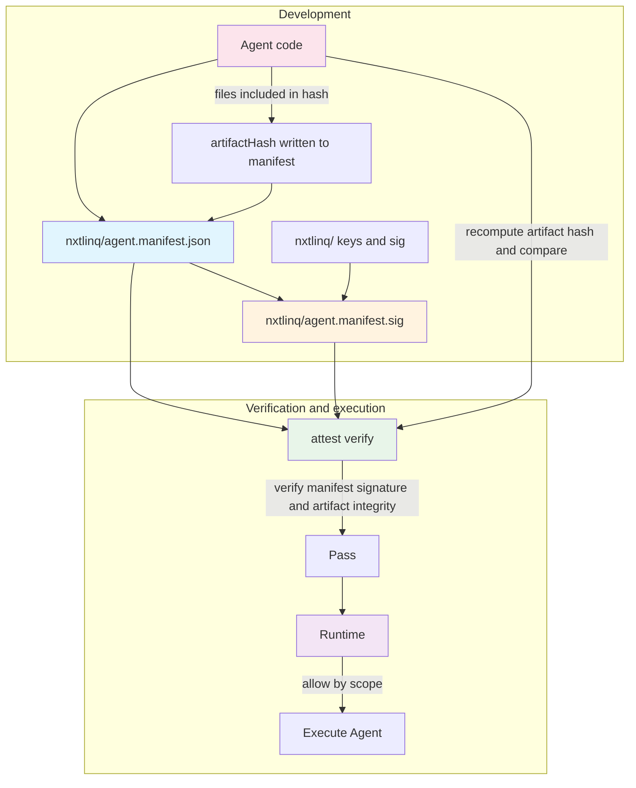

### 1.3 Goals and problems addressed

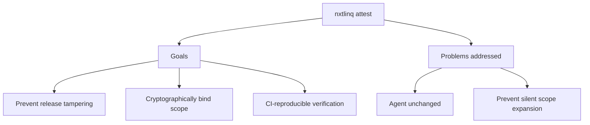

### 1.4 Value to users and platforms

Once verification confirms that the agent and manifest have not been tampered with, the concrete value to users and platforms is:

| Value | Description |
|-------|-------------|
| **Running an approved version** | A passing verify means the running agent code and declaration match what the signer signed; it reduces the risk of executing replaced or unauthorized code without knowing it. |
| **Trustworthy permission scope** | The manifest `scope` is bound by the signature and cannot be silently expanded; users and platforms can trust that the agent’s declared permissions have not been altered, which supports review and compliance. |
| **Traceability and auditability** | What was signed (contentHash, artifactHash), which public key verified it, and how many files were included (artifactFileCount) can be inspected and reproduced; mapping that to “who signed” (person or organization) is described in [2.4 Signer identity](#24-signer-identity-who-signed-and-the-public-key). |
| **Basis for platform approval** | A platform can require “only run agents that pass nxtlinq-attest verify”; the verification result becomes an enforceable policy for allowing deployment or execution, not just a verbal commitment. |
| **CI / release gate** | Running verify in the build or release pipeline and failing when it does not pass prevents tampered versions from reaching production. |

**In one sentence:** Users and platforms can **run only verified agents**, **trust that their code and permission claims have not been tampered with**, and **trace and audit** them afterward.

### 1.5 Situations where value is most apparent (when attest is really needed)

The value above is especially clear in the following situations, where attest becomes a real requirement rather than optional:

| Situation | Why the value is high |
|-----------|------------------------|
| **Platform / multi-tenant** | You provide an environment where others run agents; you need an enforceable policy: "only run agents that pass nxtlinq-attest verify." Without signing and scope, you cannot enforce "who can run what." |
| **Compliance / audit** | Finance, healthcare, government, etc. need to prove "this agent only does these things; the code has not been altered." The manifest, signature, and verify are auditable evidence. |
| **Third-party deployment / supply chain** | The agent is built or deployed by someone else (e.g. customer, partner). They need to verify that the code and declaration match and that scope has not been silently expanded. |
| **Multiple roles** | Development, operations, and security are separate teams; ops or security need "only run signed versions with clear scope," not just "trust development." |

In these situations, attest provides enforceable, verifiable, auditable grounds, not just verbal commitment.

---

## 2. Verification targets

### 2.1 What are we verifying?

**In one sentence:** When you run `nxtlinq-attest verify`, it checks two things: (1) the **manifest** is signed and has not been tampered with; (2) the **Agent artifact** has not been modified since it was signed. Both are required by the specification.

### 2.2 Verification targets (diagram)

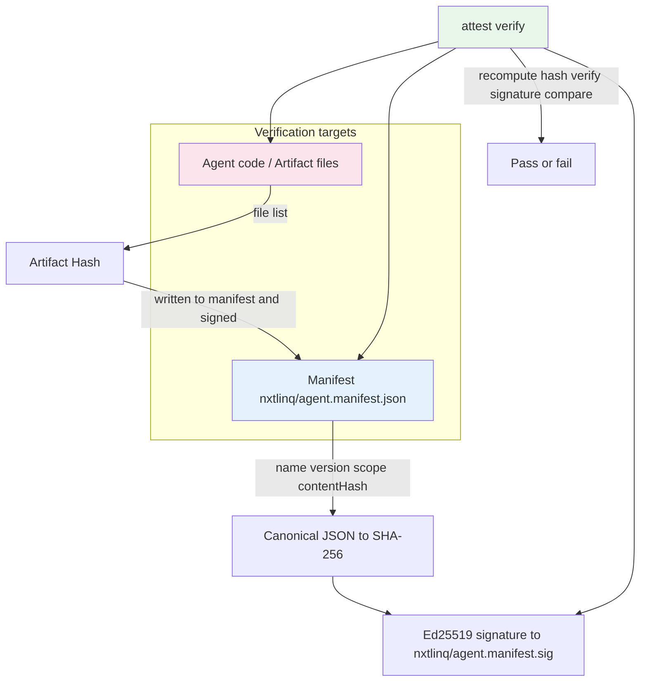

### 2.3 Verification targets (table)

| Target | Description | Verification |
|--------|-------------|--------------|
| **Manifest** | Integrity and signature of `nxtlinq/agent.manifest.json` | Canonical JSON → SHA-256 → Ed25519; recompute hash and verify on verify |
| **Agent code** | Actual agent/artifact code | Deterministic hash of included files written to manifest and signed; recompute and compare on verify |

Verifying only the manifest would allow “keep signature, replace code”; therefore **both** are verified per spec.

### 2.4 Signer identity: "who signed" and the public key

After verification you know **which public key** validated the signature (the `publicKey` in the manifest). The **public key alone is only a cryptographic identity**; it does not by itself tell you "which person or organization" signed. The private key is held by the signer and is not published, so you cannot "trace back" from the private key to an identity.

To learn "who signed" (person or organization), you need one or more of:

| Method | Description |
|--------|-------------|
| **Optional manifest field `iss`** | The signer fills in `iss` (issuer) in the manifest, e.g. team name, DID, or legal entity id. This is a **claim**; the spec does not verify its truth. Verifiers may treat it as "who signed" if they trust the source or have another way to cross-check. |
| **External registry or documentation** | The platform or organization keeps a mapping "public key ↔ entity" (e.g. this key belongs to Team A, this key is for production). After verification, look up the manifest's public key to get "who." |

So when the spec says "traceable, auditable" and "who signed," in the current design that means **which public key**; mapping that to a person or organization requires the `iss` claim or an external mapping, not the key alone.

---

## 3. Manifest specification

### 3.1 What is the manifest?

**Manifest** = The declaration file for an Agent (`nxtlinq/agent.manifest.json`), stating name, version, permission scope, and signing information, with integrity guaranteed by signature.

### 3.2 Manifest and Agent code relationship

All attest files live under **`nxtlinq/`**:

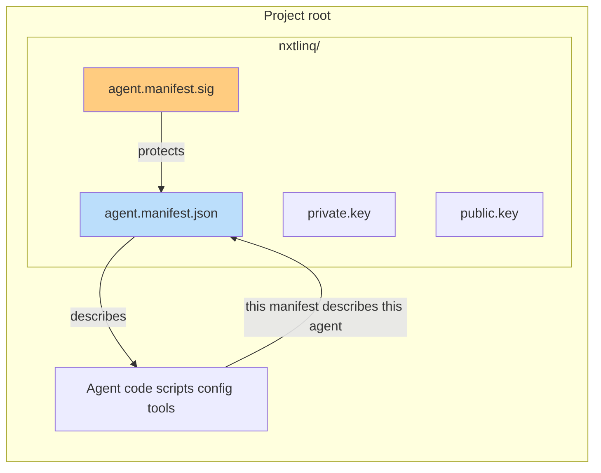

### 3.3 Required fields

The following fields are **required**; missing any causes `nxtlinq-attest verify` to fail.

| Field | Type | Description |
|-------|------|-------------|
| `name` | string | Agent name (human-readable) |
| `version` | string | Semantic version, e.g. `1.0.0` |
| `scope` | string[] | Declared permission scope (e.g. `tool:NavigateToPage`, `tool:get_server_time`, `net:http`) |
| `issuedAt` | number (Unix) or string (ISO 8601) | Signing time |
| `publicKey` | string | Public key for signature verification (e.g. `did:key:...`) |
| `contentHash` | string | SHA-256 of canonical JSON of this manifest (written by `nxtlinq-attest sign`) |
| `artifactHash` | string | Deterministic hash of Agent artifact (written by `nxtlinq-attest sign`) |

Signature is stored in a **separate file**: `nxtlinq/agent.manifest.sig`.

### 3.4 Optional fields (forward compatibility)

The fields in the first table below are optional; keeping them is recommended for logging and debugging. The fields in the second table are also optional and are not enforced in the current version:

| Field | Type | Description |
|-------|------|-------------|
| `artifactFileCount` | number | Number of files included in artifact hash (written by `nxtlinq-attest sign`; when present, verify compares file count and fails on mismatch) |
| `attestCliVersion` | string | nxtlinq-attest CLI version used at init/sign (written by init and sign); if it differs from current CLI at verify time, a note is printed so that later version incompatibilities can prompt an update or re-sign |

| Field | Type | Description |
|-------|------|-------------|
| `jti` | string | Unique ID for this attest, e.g. `attest_01HZS6Q2G7Y9M4R3J8K1` |
| `exp` | number (Unix) | Expiry (not enforced in current version) |
| `iss` | string | Signer/issuer identifier (not verified in current version) |
| `aud` | string or string[] | Intended audience (not verified in current version) |
| `audit` | object | Audit info, e.g. `request_id`, `trace_id`, `reason` |

### 3.5 Out of scope (current version)

The following are not defined or verified in the current version: `id_type`, `authority_level`, `company_id`, `project_id`, `env`, `skills`, `permissions`, `binding`, `delegation`, `connection`, `ephemeral`, `revocation`, `meta`, `nbf`, etc.

### 3.6 Example (nxtlinq/agent.manifest.json)

Path: **`nxtlinq/agent.manifest.json`**. `contentHash` and `artifactHash` are computed and written by `nxtlinq-attest sign`; do not fill manually. Placeholders from `init` are `<set by attest sign>`.

```json
{
  "name": "nxtlinq-ai-agent-demo",
  "version": "1.0.0",
  "scope": [
    "tool:NavigateToPage",
    "tool:get_server_time"
  ],
  "issuedAt": 1761072000,
  "publicKey": "<set by init>",
  "contentHash": "<set by attest sign>",
  "artifactHash": "<set by attest sign>",
  "jti": "attest_01HZS6Q2G7Y9M4R3J8K1",
  "exp": 1761072600,
  "iss": "nxtlinq",
  "aud": "their-platform",
  "audit": {
    "request_id": "req_9a3f2c",
    "trace_id": "tr_4d1b0e",
    "reason": "Attest badge allowing two low-risk tools"
  }
}
```

**User must edit before `nxtlinq-attest sign`:** `name`, `version`, `scope`. Do not manually change `publicKey`, `contentHash`, or `artifactHash`.

---

## 4. Verification scope

Currently, `nxtlinq-attest verify` checks the following two items:

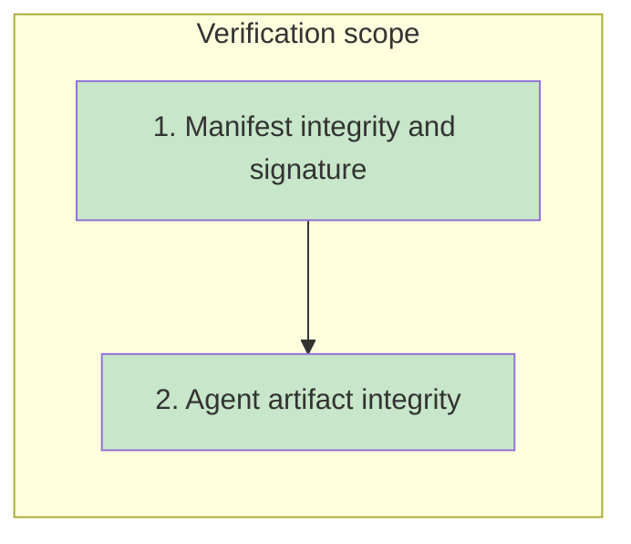

| Item | Description |
|------|-------------|
| **1. Manifest integrity and signature** | Manifest not tampered; Ed25519 signature valid (contentHash matches sig). |
| **2. Agent artifact integrity** | Files included in the artifact match what was signed (recomputed artifactHash is compared). |

---

## 5. Product goals and protection model

### 5.1 Two main goals

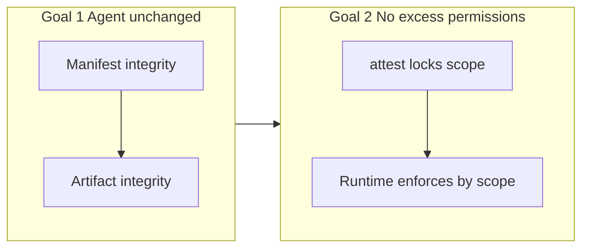

| Goal | Description | Owner |
|------|-------------|-------|
| **Goal 1** | Verify AI Agent (declaration + code) is unchanged | nxtlinq attest |
| **Goal 2** | Agent does not exceed declared permissions | attest (trusted declaration) + Runtime (enforcement) |

### 5.2 Preventing silent scope expansion: two layers

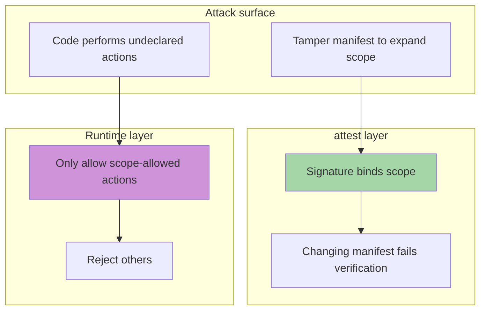

| Layer | Protects against | How |
|-------|------------------|-----|
| **attest** | Someone changing the manifest to expand scope | Signature binds scope; changes fail verification |
| **Runtime** | Code performing undeclared actions | Only allow actions corresponding to verified manifest scope |

---

## 6. attest and Runtime responsibilities

### 6.1 Responsibility boundary

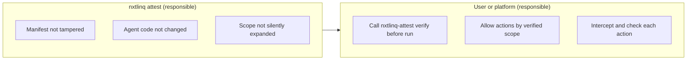

### 6.2 What attest can and cannot do

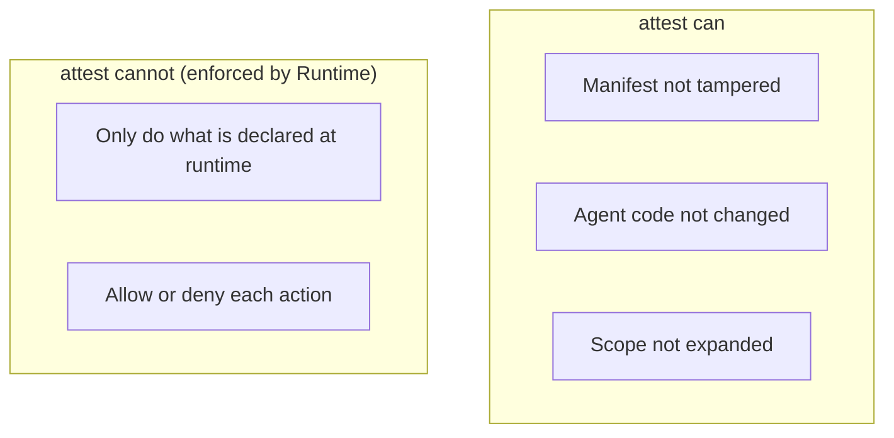

| Item | Can attest do it? |
|------|-------------------|
| Manifest not tampered | ✅ Yes |
| Agent code not changed (incl. artifact verification) | ✅ Yes |
| Declared scope not silently expanded | ✅ Yes |
| **At runtime, agent “only does” what is declared** | ❌ **No** (Runtime enforces by scope) |

### 6.3 Runtime enforcement flow (user/platform implementation)

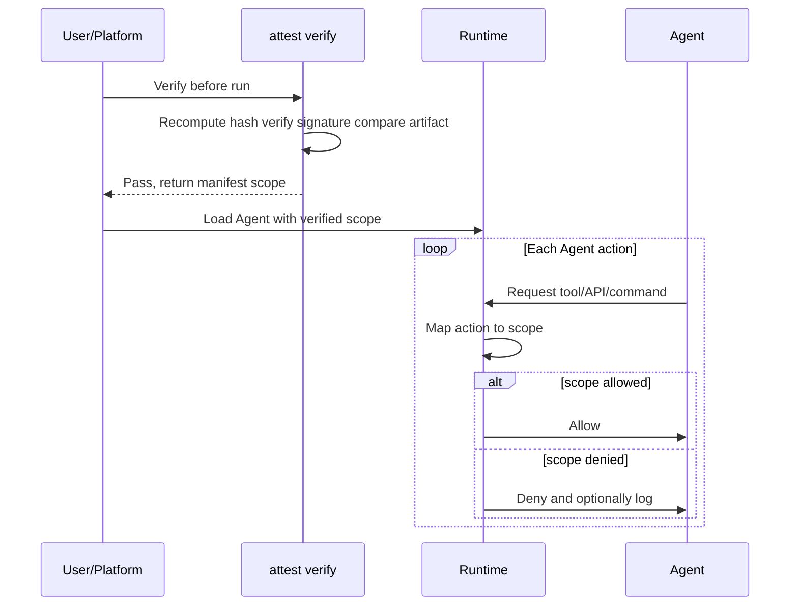

---

## 7. Signing and verification flow

### 7.1 Signing flow (attest sign)

All reads and writes are under **`nxtlinq/`** (manifest, sig, keys); artifact scan uses **project root (cwd)**.

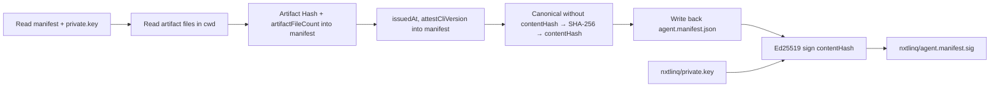

### 7.2 Verification flow (attest verify)

Read manifest, sig, and public key from **`nxtlinq/`**; recompute artifact from cwd.

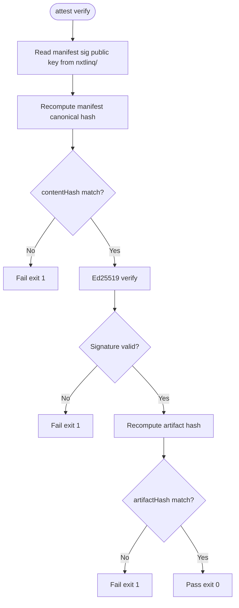

---

## 8. CLI and technical specification

### 8.1 CLI commands

| Command | Purpose | Status |
|---------|---------|-------|
| `nxtlinq-attest init` | Initialize keys and manifest skeleton | Supported |
| `nxtlinq-attest sign` | Sign manifest (including artifact hash) | Supported |
| `nxtlinq-attest verify` | Verify manifest and artifact signature and integrity | Supported |
| `nxtlinq-attest scope` | Print manifest scope array as JSON to stdout; exit 0 on success, 1 on failure (for any runtime to call) | Supported |

### 8.2 Cryptography and file paths

| Item | Specification |
|------|---------------|
| Signature algorithm | Ed25519 |
| Hash algorithm | SHA-256 |
| Manifest serialization | Canonical JSON (sorted keys, no extra whitespace, deterministic) |
| Directory | **`nxtlinq/`** |
| Private key path | `nxtlinq/private.key` (do not commit; mode 0o600 on init) |
| Public key path | `nxtlinq/public.key` |
| Manifest | `nxtlinq/agent.manifest.json` |
| Signature file | `nxtlinq/agent.manifest.sig` |

### 8.3 Implementation details

#### 8.3.1 Directory and file layout

All attest outputs live under **`nxtlinq/`**:

```
nxtlinq/
├── private.key           # Private key; sign only; do not commit
├── public.key             # Public key; used by verify
├── agent.manifest.json    # Declaration; user edits name/version/scope before sign
└── agent.manifest.sig     # Ed25519 signature (hex) over contentHash
```

- **init**: Creates `nxtlinq/`, generates key pair, writes `private.key` (0o600), `public.key`, and manifest skeleton (`publicKey` filled; `contentHash`/`artifactHash` placeholders `<set by attest sign>`).
- **sign / verify**: Both read and write manifest, sig, and keys from `nxtlinq/`; artifact scan uses **cwd (project root)** at command execution time.

#### 8.3.2 init behavior

1. Create `nxtlinq/` under cwd.
2. Generate Ed25519 key pair; write `nxtlinq/private.key` (mode 0o600), `nxtlinq/public.key`.
3. Write `nxtlinq/agent.manifest.json` with: `name`, `version`, `scope`, `issuedAt`, `publicKey` (filled), `attestCliVersion` (current CLI version), `contentHash`/`artifactHash` as `<set by attest sign>`.
4. Print prompt: edit name, version, scope in manifest then run `nxtlinq-attest sign`.

#### 8.3.3 sign behavior

1. Read `agent.manifest.json`, `private.key` from `nxtlinq/`; ensure manifest has `name`, `version`, `scope`.
2. **Artifact hash**: From cwd, list files recursively (sorted by path), exclude directories from 8.3.7 default list and, if present, 8.3.8 project-level `.nxtlinq-attest-ignore` (e.g. `node_modules`, `dist`, `__pycache__`, `.venv`, `venv`, `.git`, `nxtlinq`); for each file update SHA-256 (path + `\0` + content + `\0`), produce `artifactHash`, set `artifactFileCount` to the number of files, write both to manifest.
3. Set `issuedAt` to current Unix time (time of this signing).
4. Set `attestCliVersion` to current nxtlinq-attest CLI version (from package.json).
5. **Content hash**: Canonical JSON of manifest without `contentHash`, then SHA-256 → `contentHash`, write to manifest.
6. Write back `nxtlinq/agent.manifest.json`.
7. Sign **contentHash string** with private key (Ed25519), write hex to `nxtlinq/agent.manifest.sig`.

#### 8.3.4 verify behavior

1. Read `agent.manifest.json`, `agent.manifest.sig`, `public.key` from `nxtlinq/`; if any file is missing, fail exit 1.
2. Parse manifest as JSON; if invalid, fail exit 1. Check required fields (`name`, `version`, `scope`, `issuedAt`, `publicKey`, `contentHash`, `artifactHash`) and that `scope` is an array; if any missing or wrong type, fail exit 1.
3. Recompute canonical JSON (manifest without contentHash) → SHA-256, compare with manifest `contentHash`; on mismatch fail exit 1.
4. Verify (contentHash, sig) with public key; on invalid fail exit 1.
5. Recompute artifact hash from cwd (same exclude rules as sign; see 8.3.7, 8.3.8), compare with manifest `artifactHash`; on mismatch fail exit 1. If manifest has `artifactFileCount`, compare with actual file count; on mismatch fail exit 1.
6. If all pass, print success (and `artifactFileCount` if present). If manifest has `attestCliVersion` and it differs from current CLI version, print a note to stderr that the user may need to update nxtlinq-attest or re-sign with the current CLI. Exit 0.

#### 8.3.5 Canonical JSON

- Used for contentHash: keys in alphabetical order, no extra whitespace or newlines, so same content always yields same string.
- Types: object keys sorted; array in order; string JSON-escaped; number/boolean/null per JSON rules.

#### 8.3.6 Manifest fields: user-edited vs auto-filled

| Field | After init | After sign | User edits? |
|-------|------------|------------|-------------|
| `name` | Default `my-agent` | Unchanged | ✅ Set to real agent name |
| `version` | Default `1.0.0` | Unchanged | ✅ Set to semantic version |
| `scope` | Default `["tool:ExampleTool"]` | Unchanged | ✅ Set to real permission list |
| `issuedAt` | Set at init to current Unix time | Updated on each sign to current Unix time | Optional (usually leave as-is) |
| `publicKey` | Filled by init | Unchanged | ❌ Do not edit |
| `contentHash` | Placeholder | Filled by sign | ❌ Do not edit |
| `artifactHash` | Placeholder | Filled by sign | ❌ Do not edit |
| `artifactFileCount` | — | Filled by sign | ❌ Do not edit |
| `attestCliVersion` | Set at init to current CLI version | Updated on each sign to current CLI version | ❌ Do not edit |

#### 8.3.7 Artifact exclude list (default)

When computing artifactHash, the following are **excluded by default** (Node.js, Python, and other common environments). **Build output (e.g. dist/) is not verified**:

| Type | Excluded |
|------|----------|
| Common | `.git`, `nxtlinq`, `.DS_Store` |
| Node.js | `node_modules`, `dist` |
| Python | `__pycache__`, `.venv`, `venv`, `.pytest_cache`, `.mypy_cache` |

All other files under cwd are included, sorted by relative path.

#### 8.3.8 Project-level ignore list (.nxtlinq-attest-ignore, optional)

A **`.nxtlinq-attest-ignore`** file may be placed at the project root to **additionally** exclude directories (merged with the default list in 8.3.7). One directory basename per line; lines starting with `#` and empty lines are skipped. Example to also exclude `build`, `output`:

```
# Build and generated output — not verified
dist
build
output
```

When sign or verify runs, if this file exists under cwd it is read and merged with the default exclude list, so a project can explicitly exclude more paths (e.g. build output, output dirs) without changing CLI defaults.

### 8.4 CI integration

- Run `nxtlinq-attest verify` in GitHub Action; CI fails if verify fails.
- No blockchain, no external service; signing and verification are done locally.

