# nxtlinq attest 產品規格書

---

## 1. 總覽

### 1.1 產品定位

nxtlinq attest 是一個**完全在本地運作**的 AI Agent 簽名與驗證系統，用於確保 **Manifest（宣告）** 與 **Agent 程式（artifact）** 的完整性與權限宣告可信，並為執行時權限強制提供依據。

### 1.2 系統架構概觀

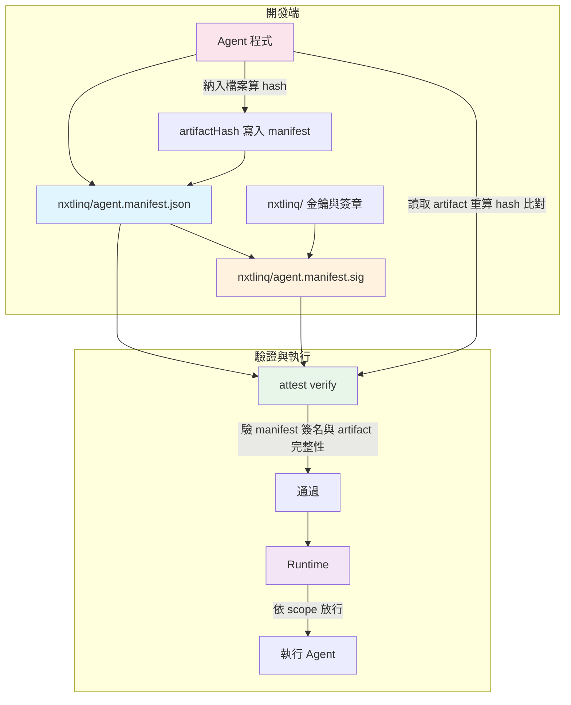

### 1.3 目標與要解決的問題

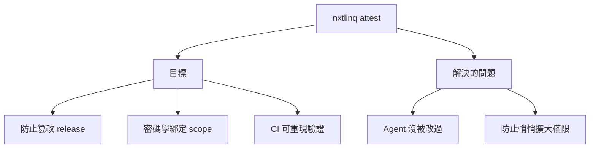

### 1.4 對使用者與平台的價值

驗證「agent 與 manifest 未被竄改」之後，對使用者與平台帶來的實際價值如下：

| 價值 | 說明 |
|------|------|
| **執行的是經認可的版本** | 驗證通過代表當前執行的 agent 程式與宣告，與簽署者曾簽署的版本一致；可避免在不知情下執行被替換或未經授權的程式。 |
| **權限範圍可被信任** | manifest 內的 `scope` 由簽名綁住，事後無法被悄悄放大；使用者或平台可相信「此 agent 宣稱的權限」未被竄改，便於審查與合規。 |
| **可追溯與可審計** | 簽了什麼（contentHash、artifactHash）、用哪把公鑰驗證、涵蓋多少檔案（artifactFileCount）皆可檢視與重現；要對應到「誰簽的」（人／組織）見 [2.4 簽署者身分](#24-簽署者身分誰簽的與公鑰的關係)。 |
| **平台准許執行的依據** | 平台可要求「僅執行通過 nxtlinq-attest verify 的 agent」；驗證結果成為准許上架或准許執行的可執行政策，而不只是口頭承諾。 |
| **CI / 發布流程把關** | 在 build 或 release 流程中執行 verify，未通過則不發布；可避免被竄改的版本流入正式環境。 |

**一句話**：使用者與平台可以**只執行通過驗證的 agent**，並**相信其程式與權限宣告未被竄改**，且事後**可追溯、可審計**。

### 1.5 價值特別明顯的情境（何時最需要 attest）

上述價值在以下情境中特別明顯，attest 成為實際需求而非可選：

| 情境 | 為何價值大 |
|------|------------|
| **平台方 / 多租戶** | 你提供環境讓他人執行 Agent，需要可執行政策：「只執行通過 nxtlinq-attest verify 的 agent」。沒有簽署與 scope，無法可執行地限制「誰能跑什麼」。 |
| **合規 / 審計** | 金融、醫療、政府等需證明「此 agent 只做這些事、程式沒被改過」。Manifest、簽名與 verify 是可被審計的證據。 |
| **第三方部署 / 供應鏈** | Agent 由他人建置或部署（如客戶、合作方）。他們需驗證：拿到的程式與宣告一致、scope 沒被悄悄放大。 |
| **多角色分工** | 開發、維運、資安為不同團隊；維運或資安要「只准跑簽過名、scope 寫清楚的版本」，而不只依賴「相信開發」。 |

在這些情境中，attest 的價值是可執行、可驗證、可審計的依據，而非口頭承諾。

---

## 2. 驗證對象

### 2.1 我們在驗證什麼？

**一句話：** 執行 `nxtlinq-attest verify` 時會驗證兩件事：（1）**宣告（manifest）** 是否經簽署且未被篡改；（2）**Agent 程式（artifact）** 自簽署後是否未被篡改。兩者皆為規格要求。

### 2.2 驗證對象關係圖

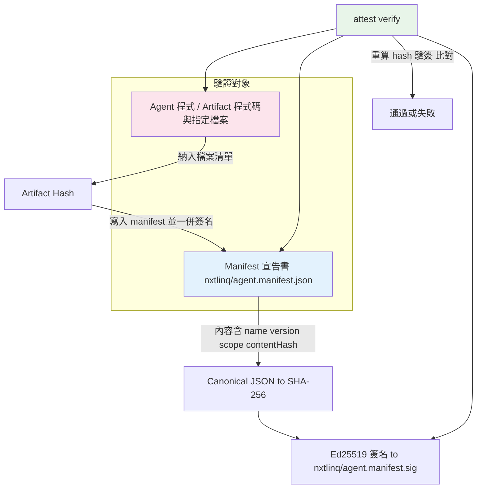

### 2.3 驗證對象對照表

| 對象 | 說明 | 驗證方式 |
|------|------|----------|
| **宣告書（manifest）** | `nxtlinq/agent.manifest.json` 完整性與簽名 | Canonical JSON → SHA-256 → Ed25519；驗證時重算 hash、驗簽 |
| **Agent 程式** | 實際 agent 程式碼／artifact | 納入檔案做確定性 hash 寫入 manifest 並簽名；驗證時重算比對 |

只驗 manifest 不驗程式會留下「保留簽名、替換程式」的缺口，因此**兩者都驗證**為規格要求。

### 2.4 簽署者身分：「誰簽的」與公鑰的關係

驗證通過後，你可得知「**用哪把公鑰**」驗過簽名（manifest 內的 `publicKey`）。但**公鑰本身只是密碼學身分**，不會自動對應到「哪個人或哪個組織」；私鑰由簽署者持有、不對外公開，也無法從私鑰「追溯回誰」。

要得知「誰簽的」（人／組織），需依賴下列其一或組合：

| 方式 | 說明 |
|------|------|
| **Manifest 選填 `iss`** | 簽署者在 manifest 中自填 `iss`（issuer／簽署者標識），例如團隊名稱、DID、或法人代號。此為**宣告**，規格不驗證其真偽；驗證方若信任該來源或另有對照管道，可視為「誰簽的」。 |
| **外部名冊或文件** | 平台或組織維護「公鑰 ↔ 實體」對照表（例如：此公鑰屬於 A 團隊、此金鑰用於正式環境），驗證後用 manifest 的公鑰查表得知「誰」。 |

因此規格書中「可追溯、可審計」所指的「誰簽的」，在現行實作下為「**哪把公鑰**」；要對應到人／組織，需透過上述 `iss` 宣告或外部對照，而非僅靠金鑰本身。

---

## 3. Manifest 規格

### 3.1 Manifest 是什麼？

**Manifest** = 描述某個 Agent 的宣告檔（`nxtlinq/agent.manifest.json`），寫明名稱、版本、權限範圍、簽署資訊，並透過簽名保證未被篡改。

### 3.2 Manifest 與 Agent 程式關係

所有 attest 相關檔案集中於 **`nxtlinq/`** 目錄：

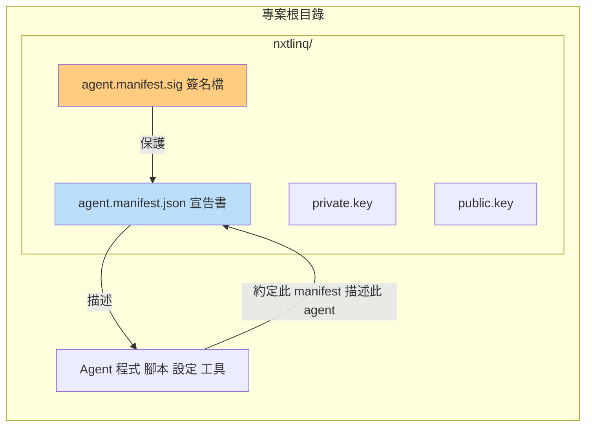

### 3.3 必要欄位（Required）

以下欄位為**必須**，缺一則 `nxtlinq-attest verify` 視為失敗。

| 欄位 | 類型 | 說明 |
|------|------|------|
| `name` | string | Agent 名稱（人類可讀） |
| `version` | string | 語意化版本，如 `1.0.0` |
| `scope` | string[] | 宣告的權限範圍（如 `tool:NavigateToPage`, `tool:get_server_time`, `net:http`） |
| `issuedAt` | number (Unix) 或 string (ISO 8601) | 簽署時間 |
| `publicKey` | string | 驗證簽名用的公鑰（可為 `did:key:...`） |
| `contentHash` | string | 對**本 manifest** 的 canonical JSON 做 SHA-256（由 `nxtlinq-attest sign` 寫入） |
| `artifactHash` | string | 對 **Agent 程式 artifact** 的確定性 hash（由 `nxtlinq-attest sign` 寫入） |

簽名存於**獨立檔案**：`nxtlinq/agent.manifest.sig`。

### 3.4 建議欄位（Optional，向前相容）

| 欄位 | 類型 | 說明 |
|------|------|------|
| `artifactFileCount` | number | 納入 artifact hash 的檔案數量（由 `nxtlinq-attest sign` 寫入；verify 時若 manifest 有此欄位則比對檔案數量，不符則失敗） |
| `attestCliVersion` | string | 執行 init／sign 時使用的 nxtlinq-attest CLI 版本（由 init 與 sign 寫入）；verify 時若與當前 CLI 版本不同會提示，便於日後版本不相容時提醒更新或重新 sign |

以上欄位為選填，建議預留供日誌與除錯。以下欄位亦為選填，目前不強制驗證：

| 欄位 | 類型 | 說明 |
|------|------|------|
| `jti` | string | 此份 attest 的唯一 ID，如 `attest_01HZS6Q2G7Y9M4R3J8K1` |
| `exp` | number (Unix) | 過期時間（目前不強制檢查） |
| `iss` | string | 簽署者／發行者標識（目前不驗證） |
| `aud` | string 或 string[] | 預期受眾（目前不驗證） |
| `audit` | object | 審計用，如 `request_id`, `trace_id`, `reason` |

### 3.5 目前不納入的欄位（Out of Scope）

以下欄位目前不定義、不驗證：`id_type`、`authority_level`、`company_id`、`project_id`、`env`、`skills`、`permissions`、`binding`、`delegation`、`connection`、`ephemeral`、`revocation`、`meta`、`nbf` 等。

### 3.6 範例（nxtlinq/agent.manifest.json）

檔案路徑：**`nxtlinq/agent.manifest.json`**。`contentHash` 與 `artifactHash` 由 `nxtlinq-attest sign` 計算並寫入，不可手動填寫；`init` 產生的佔位符為英文 `<set by attest sign>`。

```json
{
  "name": "nxtlinq-ai-agent-demo",
  "version": "1.0.0",
  "scope": [
    "tool:NavigateToPage",
    "tool:get_server_time"
  ],
  "issuedAt": 1761072000,
  "publicKey": "<set by init>",
  "contentHash": "<set by attest sign>",
  "artifactHash": "<set by attest sign>",
  "jti": "attest_01HZS6Q2G7Y9M4R3J8K1",
  "exp": 1761072600,
  "iss": "nxtlinq",
  "aud": "their-platform",
  "audit": {
    "request_id": "req_9a3f2c",
    "trace_id": "tr_4d1b0e",
    "reason": "Attest badge allowing two low-risk tools"
  }
}
```

**使用者須在 `nxtlinq-attest sign` 前編輯**：`name`、`version`、`scope`。勿手動修改 `publicKey`、`contentHash`、`artifactHash`。

---

## 4. 驗證範圍

目前 `nxtlinq-attest verify` 會檢查以下兩項：

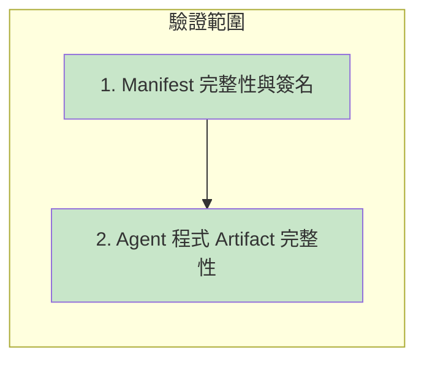

| 項目 | 說明 |
|------|------|
| **1. Manifest 完整性與簽名** | manifest 未被篡改、Ed25519 簽名有效（contentHash 與 sig 一致）。 |
| **2. Agent 程式（artifact）完整性** | 專案內納入 artifact 的檔案與簽署時一致（重算 artifactHash 比對）。 |

---

## 5. 產品目的與防護模型

### 5.1 兩大目的

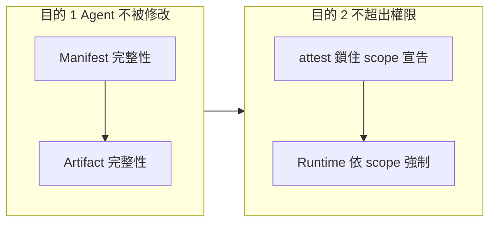

| 目的 | 說明 | 負責方 |
|------|------|--------|
| **目的 1** | 驗證 AI Agent（宣告 + 程式）不被修改 | nxtlinq attest |
| **目的 2** | 讓 Agent 不做出超出權限的事 | attest（可信宣告）+ Runtime（執行時強制） |

### 5.2 防止悄悄擴大權限：兩層防護

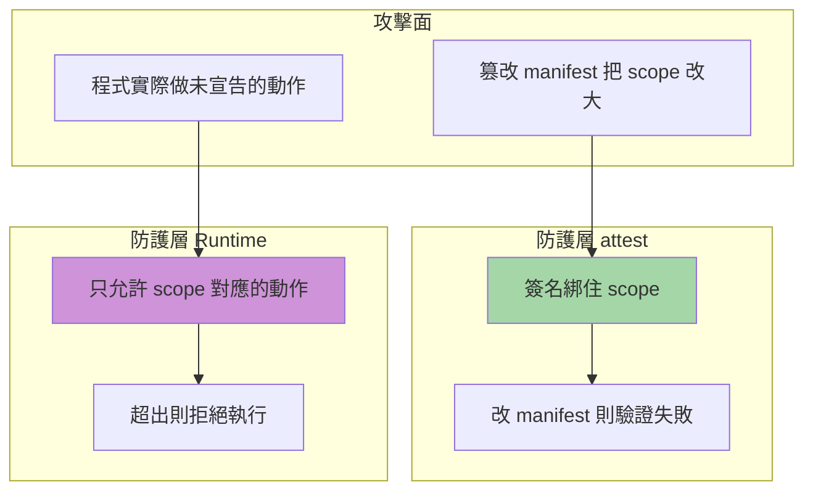

| 層 | 防的是什麼 | 怎麼防 |
|----|------------|--------|
| **attest** | 有人偷偷改 manifest 把 scope 改大 | 簽名綁住 scope；改了就驗證失敗 |
| **Runtime** | 程式做出沒宣告的動作 | 只允許 manifest 中已驗證的 scope 所對應的動作 |

---

## 6. attest 與 Runtime 分工

### 6.1 責任邊界

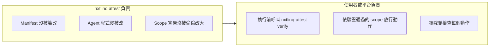

### 6.2 attest 能 / 不能做的事

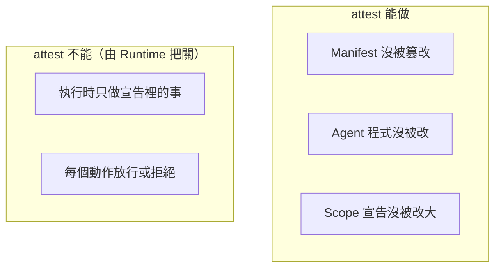

| 項目 | attest 能否做 |
|------|----------------|
| Manifest 沒被篡改 | ✅ 能 |
| Agent 程式沒被改（含 artifact 驗證） | ✅ 能 |
| 宣告的 scope 沒被偷偷改大 | ✅ 能 |
| **執行時 agent 是否「只做」宣告裡的事** | ❌ **不能**（由 Runtime 依 scope 把關） |

### 6.3 Runtime 強制流程（使用者／平台實作）

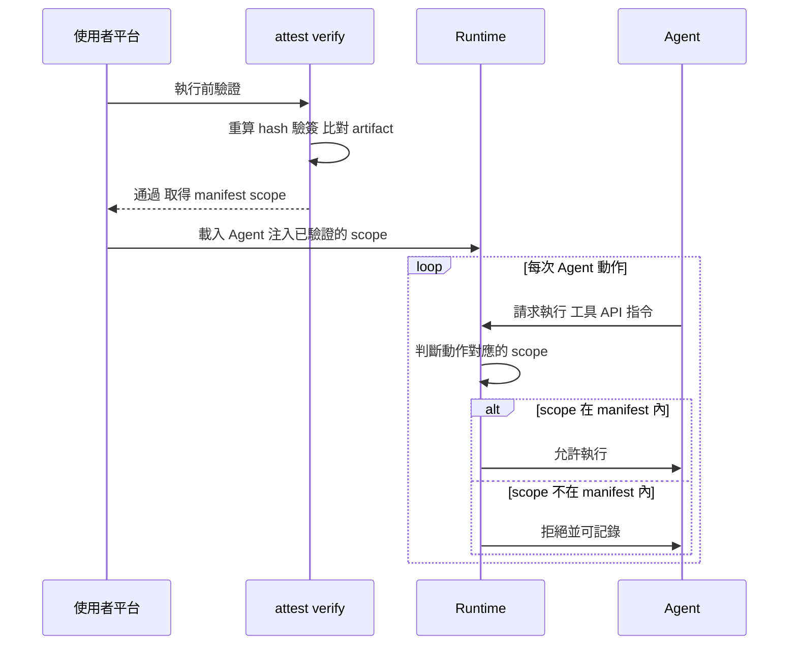

---

## 7. 簽名與驗證流程

### 7.1 簽名流程（attest sign）

所有讀寫皆在 **`nxtlinq/`** 目錄下（manifest、sig、金鑰）；artifact 掃描以**專案根目錄（cwd）**為準。

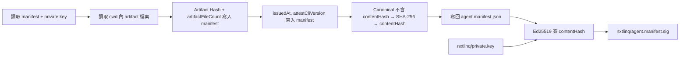

### 7.2 驗證流程（attest verify）

自 **`nxtlinq/`** 讀取 manifest、sig、公鑰；artifact 以 cwd 重算。

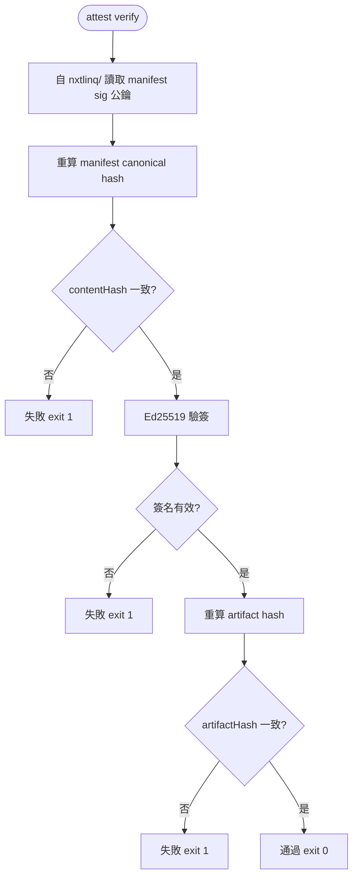

---

## 8. CLI 與技術規格

### 8.1 CLI 指令

| 指令 | 用途 | 狀態 |
|------|------|------|
| `nxtlinq-attest init` | 初始化金鑰與 manifest 骨架 | 支援 |
| `nxtlinq-attest sign` | 對 manifest（含 artifact hash）簽名 | 支援 |
| `nxtlinq-attest verify` | 驗證 manifest 與 artifact 簽名及完整性 | 支援 |
| `nxtlinq-attest scope` | 將 manifest 的 scope 陣列以 JSON 輸出到 stdout；成功 exit 0、失敗 exit 1（供任何執行環境呼叫取得） | 支援 |
| `nxtlinq-attest -v` / `nxtlinq-attest --version` | 輸出 CLI 版本並結束 | 支援 |

### 8.2 密碼學與檔案路徑

| 項目 | 規格 |
|------|------|
| 簽名演算法 | Ed25519 |
| 雜湊演算法 | SHA-256 |
| Manifest 序列化 | Canonical JSON（鍵排序、無多餘空白，確定性） |
| 目錄 | **`nxtlinq/`** |
| 私鑰路徑 | `nxtlinq/private.key`（不可 commit，init 時 mode 0o600） |
| 公鑰路徑 | `nxtlinq/public.key` |
| Manifest | `nxtlinq/agent.manifest.json` |
| 簽名檔 | `nxtlinq/agent.manifest.sig` |

### 8.3 實作細節

#### 8.3.1 目錄與檔案佈局

所有 attest 產物集中於 **`nxtlinq/`**：

```
nxtlinq/
├── private.key           # 私鑰，僅 sign 使用，勿 commit
├── public.key             # 公鑰，verify 使用
├── agent.manifest.json    # 宣告；使用者須編輯 name / version / scope 後再 sign
└── agent.manifest.sig     # 對 contentHash 的 Ed25519 簽章（hex）
```

- **init**：建立 `nxtlinq/`，產生金鑰對，寫入 `private.key`（0o600）、`public.key`，並寫入 manifest 骨架（`publicKey` 已填，`contentHash` / `artifactHash` 為佔位符 `<set by attest sign>`）。
- **sign / verify**：皆自 `nxtlinq/` 讀寫 manifest、sig、金鑰；artifact 掃描以**執行指令時之 cwd（專案根目錄）**為準。

#### 8.3.2 init 行為

1. 於 cwd 建立 `nxtlinq/`。
2. 產生 Ed25519 金鑰對；寫入 `nxtlinq/private.key`（mode 0o600）、`nxtlinq/public.key`。
3. 寫入 `nxtlinq/agent.manifest.json`，內含：`name`, `version`, `scope`, `issuedAt`, `publicKey`（已填），`attestCliVersion`（當前 CLI 版本），`contentHash` / `artifactHash` 為 `<set by attest sign>`。
4. 輸出提示：請編輯 manifest 的 name、version、scope 後執行 `nxtlinq-attest sign`。

#### 8.3.3 sign 行為

1. 自 `nxtlinq/` 讀取 `agent.manifest.json`、`private.key`；檢查 manifest 具備 `name`、`version`、`scope`。
2. **Artifact hash**：以 cwd 為根，遞迴列檔（依路徑排序），排除 8.3.7 預設目錄及 8.3.8 專案級 `.nxtlinq-attest-ignore`（若有）所列目錄（如 `node_modules`、`dist`、`__pycache__`、`.venv`、`venv`、`.git`、`nxtlinq` 等）；對每個檔案依序更新 SHA-256（路徑 + `\0` + 內容 + `\0`），得到 `artifactHash`，並將檔案數量寫入 `artifactFileCount`，一併寫入 manifest。
3. 將 `issuedAt` 設為當前 Unix 時間（此次簽署時間）。
4. 將 `attestCliVersion` 設為當前 nxtlinq-attest CLI 版本（自 package.json 讀取）。
5. **Content hash**：將 manifest 扣除 `contentHash` 後做 canonical JSON，再 SHA-256 得到 `contentHash`，寫入 manifest。
6. 寫回 `nxtlinq/agent.manifest.json`。
7. 以私鑰對 **contentHash 字串**做 Ed25519 簽名，hex 寫入 `nxtlinq/agent.manifest.sig`。

#### 8.3.4 verify 行為

1. 自 `nxtlinq/` 讀取 `agent.manifest.json`、`agent.manifest.sig`、`public.key`；若任一檔案不存在則失敗 exit 1。
2. 解析 manifest 為 JSON；若無效則失敗 exit 1。檢查必要欄位（`name`, `version`, `scope`, `issuedAt`, `publicKey`, `contentHash`, `artifactHash`）與 `scope` 為陣列；缺一或型別不符則失敗 exit 1。
3. 重算 manifest（扣除 contentHash）的 canonical JSON → SHA-256，與 manifest 內 `contentHash` 比對；不符則失敗 exit 1。
4. 以公鑰驗證「contentHash 與 sig」；無效則失敗 exit 1。
5. 以 cwd 為根重算 artifact hash（排除規則同 sign，見 8.3.7、8.3.8），與 manifest 內 `artifactHash` 比對；不符則失敗 exit 1。若 manifest 有 `artifactFileCount`，則比對實際檔案數量，不符則失敗 exit 1。
6. 全部通過則輸出通過訊息（含 `artifactFileCount` 若存在）。若 manifest 有 `attestCliVersion` 且與當前 CLI 版本不同，則於 stderr 提示：可能需更新 nxtlinq-attest 或以當前 CLI 重新 sign。exit 0。

#### 8.3.5 Canonical JSON

- 用於 contentHash：鍵依字母排序、無多餘空白與換行，確保同一內容產生同一字串。
- 型別：object 鍵排序；array 依序；string 以 JSON 跳脫；number/boolean/null 依 JSON 規則。

#### 8.3.6 Manifest 欄位：使用者編輯 vs 自動填入

| 欄位 | init 後 | sign 後 | 使用者是否編輯 |
|------|--------|--------|----------------|
| `name` | 預設 `my-agent` | 不變 | ✅ 應改為實際 agent 名稱 |
| `version` | 預設 `1.0.0` | 不變 | ✅ 應改為語意化版本 |
| `scope` | 預設 `["tool:ExampleTool"]` | 不變 | ✅ 應改為實際權限列表 |
| `issuedAt` | init 寫入當時 Unix 時間 | 每次 sign 更新為當時 Unix 時間 | 可選（通常不手改） |
| `publicKey` | 由 init 寫入 | 不變 | ❌ 勿改 |
| `contentHash` | 佔位符 | 由 sign 寫入 | ❌ 勿改 |
| `artifactHash` | 佔位符 | 由 sign 寫入 | ❌ 勿改 |
| `artifactFileCount` | — | 由 sign 寫入 | ❌ 勿改 |
| `attestCliVersion` | 由 init 寫入當前 CLI 版本 | 每次 sign 更新為當前 CLI 版本 | ❌ 勿改 |

#### 8.3.7 Artifact 排除清單（預設）

計算 artifactHash 時，下列目錄／檔案**預設**不納入（同時涵蓋 Node.js 與 Python 等常見開發環境）；**build 產物（如 dist/）不參與驗證**：

| 類型 | 排除項目 |
|------|----------|
| 共通 | `.git`、`nxtlinq`、`.DS_Store` |
| Node.js | `node_modules`、`dist` |
| Python | `__pycache__`、`.venv`、`venv`、`.pytest_cache`、`.mypy_cache` |

其餘在 cwd 下的檔案依相對路徑排序後納入 hash。

#### 8.3.8 專案級忽略清單（.nxtlinq-attest-ignore，選用）

專案根目錄可放置 **`.nxtlinq-attest-ignore`**，用於**額外**排除目錄（與 8.3.7 預設清單合併）。每行一個目錄 basename；以 `#` 開頭或空行會略過。例如要再排除 `build`、`output`：

```
# Build and generated output — not verified
dist
build
output
```

sign / verify 執行時，若 cwd 下存在此檔則讀取並與預設排除清單合併，使該專案明確排除更多路徑（如 build 產物、輸出目錄），而不改動 CLI 預設行為。

### 8.4 CI 整合

- GitHub Action 執行 `nxtlinq-attest verify`，失敗則 CI 失敗。
- 無需區塊鏈、無需連線至外部服務，簽名與驗證均在本地完成。

